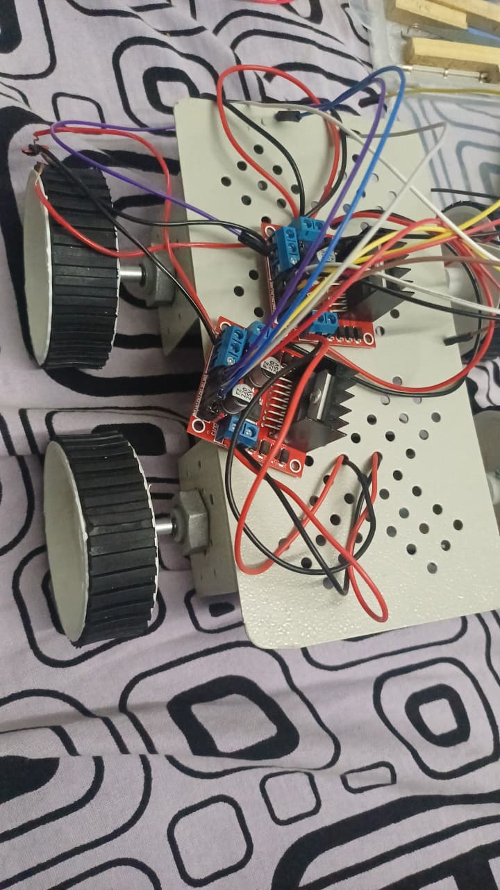
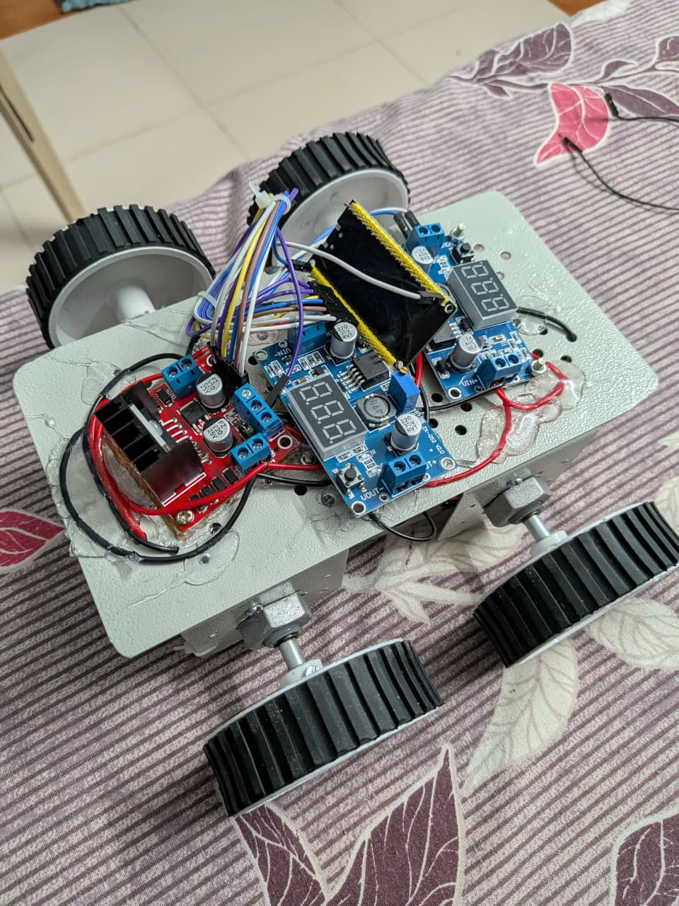

# ESP32 Robot Car

## 🚀 Project Overview
This project involves building a remote-controlled vehicle powered by the ESP32 microcontroller, featuring custom control logic. 
- **What problem it solves:** Provides a flexible, robust platform for learning robotics, wireless communication, and embedded systems programming.
- **Why ESP32?:** The ESP32 offers built-in WiFi and Bluetooth capabilities, dual-core processing power, and plenty of GPIO pins for controlling motors and reading sensors, making it an ideal brain for a smart RC car.

## 🎯 Features
- Remote control via custom controller
- Wireless communication capabilities (WiFi / Bluetooth / nRF24)
- Precise motor control, directional steering, and speed adjustment
- Highly extensible for future sensor additions

## 🧠 System Architecture
The system consists of two main parts: the Controller and the Robot Car. The controller sends directional and speed commands wirelessly to the ESP32 on the car. The ESP32 processes these commands and sends PWM signals to the motor driver, which in turn drives the DC motors to move the car.

## 🔌 Hardware Components
- ESP32 Microcontroller
- L298N (or similar) Motor Driver
- DC Motors with Gearboxes & Wheels
- Robot Car Chassis kit
- Battery Pack & Power Module
- Transceiver Module (e.g., nRF24L01 or built-in Bluetooth)

## ⚙️ Software Requirements
- **Arduino IDE** (or PlatformIO)
- ESP32 Board Package installed in Arduino IDE
- Required libraries for communication and motor control

## 📲 How to Run
Follow these step-by-step instructions to get the code running:

1. Clone this repository: `git clone https://github.com/praveen-8811/RC-Car.git`
2. Open the `.ino` code located in the `code_using_controller` folder using the Arduino IDE.
3. Select your specific **ESP32 board** and the correct **COM port** under the Tools menu.
4. Click **Upload** to flash the code to your ESP32 microcontroller.

## 🎮 Controls
- **Forward:** Both motors spin forward.
- **Backward:** Both motors spin in reverse.
- **Left:** Right motor spins forward, left motor spins backward (or stops) to turn left.
- **Right:** Left motor spins forward, right motor spins backward (or stops) to turn right.

## 📸 Output / Demo
Here is the robot car in action!

*(Check out `vid_1.mp4` and `vid_2.mp4` in the `assets` folder for full video demonstrations!)*

---
*Detailed project documentation, including schematics and design choices, can be found in the attached Word and PDF reports in this repository.*
